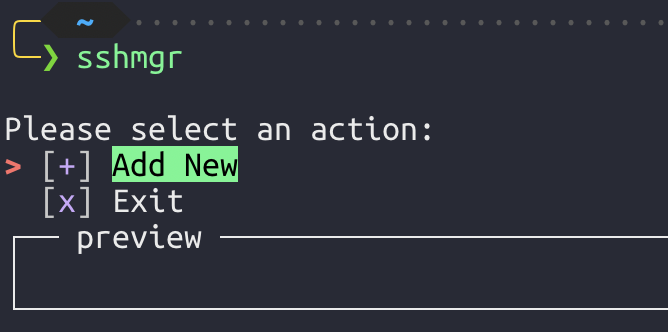
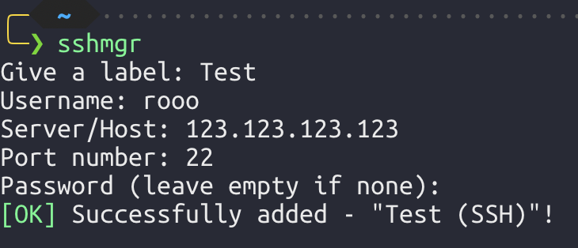
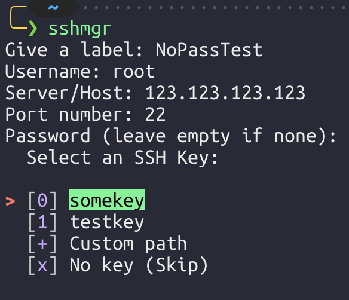
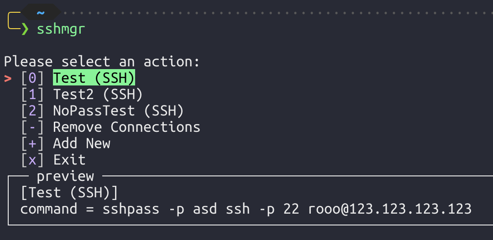
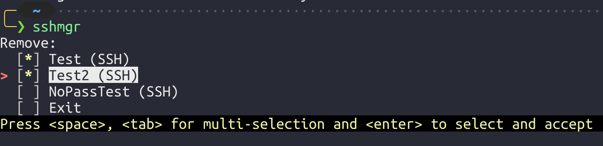

<h2 align="center">SSH Manager (SSHMGR)</h2> 
 <h4 align="center">
  <a href="https://github.com/MladenSU/SSH-Manager/blob/main/LICENSE.md">
    
  </a>
  
  
  
  
  
  
  
</h4>

---

- [Installation and setup](#installation-and-setup)
- [Usage](#usage)
- [Planned features](#planned-features)
- [Social Media :mailbox\_with\_no\_mail:](#social-media-mailbox_with_no_mail)

---
## Installation and setup
1. Clone the repo:
    ```python
    git clone https://github.com/MladenSU/sshmgr.git
    ```
2. Go into the folder and install the necessary Python packages
   ```bash
   cd sshmgr
   python3 -m pip install -r requirements.txt
   ```
3. Make the script executable
    ```bash
    chmod +x main.py
    ```
4. Run it and enjoy
    ```bash
    ./main.py
    # or
    python3 main.py
    ```
5. (Optional) You can create a symlink at your favorite PATH location so you can execute it from anywhere. Example:
    ```bash
    ln -s /Users/xxxxxxx/sshmgr/main.py /usr/local/bin/sshmgr
    ```
    > Then you will be able to access the tool just by writing down sshmgr in the console.

    > :warning: In case it is not working, make sure to include the path where the script resides in your PATH variable. For more info click [here](https://www.digitalocean.com/community/tutorials/how-to-view-and-update-the-linux-path-environment-variable).
---
## Usage
Let's say that you've already created symbolic link somewhere within your `PATH` and the executable is called `sshmgr`.

1. Since the credentials file is empty, the script will return the following at first:
  
    > You can use the arrow keys to navigate or you can use your keyboard. The signs/numbers inside the "[]" (e.g. [+]) are the actual keybinds to access the displayed function
2. By selecting the "`[+] Add New`" you will be prompted to fill in particular details:
  
    > By filling a password the command that will be used to autofill the password upon login is `sshpass` (Make sure to install it).
3. If you leave the password empty, you will be prompted to select an SSH key:
  
    > If you skip adding a key and password, you will be simply prompted with a password when attempting to log in over SSH (password auth SSH connection).
4. The tool has a preview feature, where you can see what will be executed prior to hitting "Enter":
  
5. Finally since we have the ability to add, we should have the ability to remove. You're damn right and you can remove multiple entries at once:
  
6. Quick intro
<iframe src='https://gfycat.com/ifr/EveryOrangeGilamonster' frameborder='0' scrolling='no' allowfullscreen width='640' height='402'></iframe>

---
## Planned features
- [ ] GUI
- [ ] Custom search by name of the label
- [ ] Setup script for easier setup
- [ ] Package for different OS
  - [ ] RPM
  - [ ] Brew
  - [ ] DEB
- [ ] Enable disable preview feature
---

## Social Media :mailbox_with_no_mail:
[](https://github.com/MladenSU/)

- If you would like to suggest a feature, feel free to write an [email](mailto:mladen.projects@gmail.com).
- For bugs, feel free to open an issue or pull request :)

